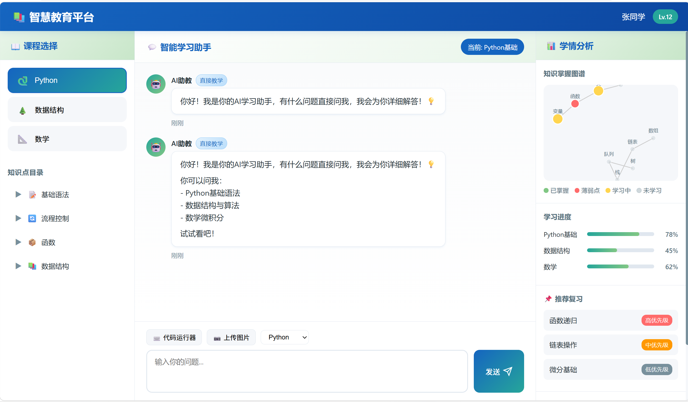

# 📚 Tutor Agent 教学辅导系统

基于 **FastAPI + LangGraph 多 Agent 编排**的智能教学辅导系统，集成 RAG 知识库、三层记忆管理和 MCP 工具协议，提供个性化、流式交互的 AI 辅导体验。

[](https://www.python.org/)
[](https://fastapi.tiangolo.com/)
[](https://fastapi.tiangolo.com/)
[](https://www.trychroma.com/)
[](LICENSE)

---

## 🖥️ 界面预览



---

## ✨ 核心特性

### 🧠 多 Agent 协作架构
- **Router Agent** —— 智能路由，分析学生问题并分发到最合适的专业 Agent
- **Math Tutor** —— 数学与逻辑推理教学
- **Programming Tutor** —— 编程教学、代码调试与算法讲解
- **Knowledge Agent** —— 课本知识与概念问答（含 RAG 检索增强）
- **Assessor Agent** —— 学习评估与薄弱环节分析

> 上述 4 个 specialist 由 LangGraph 的 `create_react_agent` 实现为带真实 tool-calling 的 ReAct 子图，由 supervisor 按 Router 分类结果条件路由调度（详见下方「🧩 LangGraph 多 Agent 编排」）。

### 🎓 双教学模式
- **苏格拉底式引导（Socratic）** —— 通过反问和提示引导学生自主思考，不直接给答案
- **直接教学（Direct）** —— 结构化讲解知识点，配合示例和练习

### 💾 三层记忆系统
| 层级 | 存储 | 用途 |
|------|------|------|
| 短期记忆 | Redis | 当前会话对话上下文，TTL 自动过期 |
| 中期记忆 | JSON + Redis | 跨学科薄弱点追踪，移动平均更新 |
| 长期记忆 | ChromaDB | 知识图谱向量存储，持久化学生画像 |

### 🔍 RAG 知识库
- 预设 **Python 基础**（变量、函数、类、异常处理）和**数据结构**（数组、链表、栈、队列、树）课程内容
- 基于 ChromaDB 的向量化存储与混合检索（向量相似度 + 关键词重排序）
- 支持上传自定义学习材料扩展知识库

### 🌊 SSE 流式交互
- 实时 Server-Sent Events 流式推送，逐 token 展示回复
- 支持路由信息、token 流、练习题推荐、代码验证等多类型事件

### 📊 知识图谱可视化
- 基于 **D3.js** 的力导向图，直观展示学生知识点掌握状况
- 颜色编码：🟢 已掌握 / 🟡 学习中 / 🔴 薄弱 / ⚪ 未学习

### 🔧 更多功能
- **代码在线执行** —— 浏览器内 Python 沙箱，即时运行与输出展示
- **练习题生成与评估** —— 根据薄弱点自动出题并评分，更新学习档案
- **意图识别** —— 自动识别问候、自我介绍、名字询问、对话历史引用等 7 种意图
- **图片上传分析** —— 支持作业截图/题目照片上传，通过视觉模型（qwen-vl-max）识别内容
- **MCP 工具集成** —— Model Context Protocol 工具服务器，可扩展练习生成、代码执行、评估等能力
- **Docker 容器化部署** —— 基于 docker-compose 的一键容器化运行，便于本地与服务器部署

---

## 🧩 LangGraph 多 Agent 编排

教学主链路采用 **LangGraph supervisor 多 Agent** 模式，由状态图（StateGraph）统一调度：

- **Supervisor 路由**：复用 Router 的问题分类结果 `classification.agent_type`，经条件边直接路由到对应 specialist 子图，无需额外 LLM 调用
- **4 个 ReAct specialist 子图**：`math` / `programming` / `knowledge` / `assessor`，每个由 `langgraph.prebuilt.create_react_agent` 编译，LLM 自主决策调用工具
- **真实 tool-calling**：工具以 LangChain `@tool` 包装并真正被 LLM 调用（RAG 检索 / Python 代码沙箱 / 练习生成 / 答案评估），而非仅以文本注入 Prompt
- **共享状态**：基于 `MessagesState` 的 `add_messages` 规约，specialist 子图与 supervisor 共享同一份对话历史
- **流式输出**：编译图通过 `astream_events(v2)` 把 `on_chat_model_stream` / `on_tool_end` / `on_chain_end` 事件映射为 SSE（token / sources / done / error），逐 token 推送到前端

图结构：`START →(按 agent_type 路由)→ specialist → update_memory → generate_exercises → END`

---

## 🏗️ 系统架构

```
┌──────────────────────────────────────────────────────────┐
│                       Frontend                           │
│          HTML5 + CSS3 + Vanilla JS + D3.js               │
│               SSE Stream Consumer                        │
└──────────────────────┬───────────────────────────────────┘
                       │ HTTP/SSE
┌──────────────────────▼───────────────────────────────────┐
│                   FastAPI Server                         │
│  ┌─────────────────────────────────────────────────────┐ │
│  │                  Router Agent                       │ │
│  │          (LLM分类 + 关键词规则兜底)                   │ │
│  └──────┬──────────┬──────────┬───────────┬───────────┘ │
│         │          │          │           │              │
│  ┌──────▼──┐ ┌─────▼───┐ ┌───▼────┐ ┌───▼────────┐     │
│  │  Math   │ │Program- │ │Know-   │ │ Assessor   │     │
│  │  Tutor  │ │ming     │ │ledge   │ │ Agent      │     │
│  │         │ │Tutor    │ │Agent   │ │            │     │
│  └────┬────┘ └────┬────┘ └───┬────┘ └─────┬──────┘     │
│       │           │          │             │             │
│  ┌────▼───────────▼──────────▼─────────────▼──────┐     │
│  │              LearningMemory                     │     │
│  │   Short-term(Redis) / Mid-term(JSON) /          │     │
│  │   Long-term(ChromaDB)                           │     │
│  └──────────────────────┬──────────────────────────┘     │
│                         │                                 │
│  ┌──────────────────────▼──────────────────────────┐     │
│  │        EducationKnowledgeBase (ChromaDB)         │     │
│  │         Python / Data Structures RAG             │     │
│  └─────────────────────────────────────────────────┘     │
│                                                          │
│  ┌─────────────────────────────────────────────────┐     │
│  │              MCP Tool Servers                     │     │
│  │   Exercise Generator / Code Executor / Assessor  │     │
│  └─────────────────────────────────────────────────┘     │
└──────────────────────┬───────────────────────────────────┘
                       │
┌──────────────────────▼───────────────────────────────────┐
│            Alibaba Cloud DashScope (Qwen)                 │
│       LLM: qwen-max  |  Embedding: text-embedding-v2      │
│       Vision: qwen-vl-max                                 │
└──────────────────────────────────────────────────────────┘
```

---

## 🚀 快速开始

### 环境要求

- Python 3.11+
- Redis（可选，用于短期会话记忆；未安装时自动降级为内存存储）
- 阿里云百炼 (DashScope) API Key

### 1. 克隆项目

```bash
git clone <repository-url>
cd education_agent
```

### 2. 安装依赖

```bash
# 使用 pip
pip install -r requirements.txt

# 或使用 uv（推荐，更快）
uv sync
```

### 3. 配置环境变量

```bash
cp .env.example .env
```

编辑 `.env` 文件，填入你的 API Key：

```env
# 阿里云百炼 (DashScope) API 密钥（必填）
DASHSCOPE_API_KEY=your_api_key_here

# 大语言模型配置（可选）
LLM_MODEL=qwen-max
EMBEDDING_MODEL=text-embedding-v2
VISION_MODEL=qwen-vl-max

# 服务配置（可选）
HOST=0.0.0.0
PORT=8000
UPLOAD_DIR=./uploads

# Redis 配置（可选，未安装时自动降级）
REDIS_HOST=localhost
REDIS_PORT=6379
```

### 4. 启动服务

```bash
# 方式一：使用启动脚本
python run.py

# 方式二：直接使用 uvicorn
python -m uvicorn backend.main:app --host 0.0.0.0 --port 8000 --reload
```

启动后访问：
- 🖥️ **前端界面**: http://localhost:8000
- 📖 **API 文档 (Swagger)**: http://localhost:8000/docs
- 📘 **API 文档 (ReDoc)**: http://localhost:8000/redoc

### 5. Docker 部署

```bash
# 使用 Docker Compose 启动服务
docker-compose up -d

# 包含以下服务：
#   - 应用实例（FastAPI + Uvicorn）
#   - ChromaDB 向量数据库
#   - Redis（短期/中期记忆）
```

---

## 📡 API 接口

### 核心接口

| 方法 | 路径 | 说明 |
|------|------|------|
| `POST` | `/api/tutor` | **SSE 流式辅导** —— 核心接口，流式返回 AI 辅导回复 |
| `POST` | `/api/exercise/generate` | 生成练习题 |
| `POST` | `/api/exercise/evaluate` | 评估学生答案 |
| `POST` | `/api/execute-code` | 在线执行 Python 代码 |
| `GET` | `/api/student/{id}/profile` | 获取学生完整画像 |
| `GET` | `/api/student/{id}/study-plan` | 获取个性化学习计划 |
| `GET` | `/api/student/{id}/knowledge-graph` | 获取知识图谱数据（供 D3.js） |
| `POST` | `/api/student/{id}/update-weak-point` | 更新知识点得分 |
| `GET` | `/api/knowledge/search` | 知识库混合检索 |
| `GET` | `/api/knowledge/topics` | 列出科目知识点 |
| `POST` | `/api/upload-image` | 上传图片并分析 |
| `DELETE` | `/api/session/{id}` | 清除会话记忆 |
| `GET` | `/api/session/{id}/history` | 获取会话历史 |
| `GET` | `/api/mcp/tools` | 列出 MCP 工具 |

### SSE 流式辅导示例

```javascript
// 发送流式请求
const response = await fetch('/api/tutor', {
    method: 'POST',
    headers: { 'Content-Type': 'application/json' },
    body: JSON.stringify({
        question: "什么是 Python 的闭包？",
        session_id: "session_abc123",
        student_id: "student_001",
        subject: "python",
        mode: "direct"  // "socratic" | "direct"
    })
});

// 读取 SSE 事件流
const reader = response.body.getReader();
const decoder = new TextDecoder();
while (true) {
    const { done, value } = await reader.read();
    if (done) break;
    const text = decoder.decode(value);
    // 解析 "data: {...}\n\n" 格式的 SSE 消息
}

// SSE 消息类型：
// - { type: "route", agent, subject, confidence }  — 路由信息
// - { type: "token", token, agent, mode }           — 文本片段
// - { type: "code_validation", issues }             — 代码验证
// - { type: "done", exercises, weak_points }         — 完成信号
// - { type: "error", error }                         — 错误信号
```

---

## 📂 项目结构

```
education_agent/
├── backend/                     # 后端核心代码
│   ├── main.py                  # FastAPI 应用入口，lifespan 管理
│   ├── api.py                   # API 路由层，SSE 流式辅导
│   ├── config.py                # 应用配置（环境变量）
│   ├── models.py                # 数据模型（AgentType, 请求/响应）
│   ├── llm.py                   # LLM/Embedding/Vision 模型封装
│   ├── rag.py                   # RAG 知识库（ChromaDB 向量存储）
│   ├── memory.py                # 三层记忆系统
│   ├── agents/                  # Agent 实现
│   │   ├── base_tutor.py        # 基础 Tutor 抽象类
│   │   ├── router_agent.py      # 路由 Agent（LLM + 规则兜底）
│   │   ├── math_tutor.py        # 数学教学 Agent
│   │   ├── programming_tutor.py # 编程教学 Agent
│   │   ├── knowledge_agent.py   # 知识问答 Agent
│   │   └── assessor_agent.py    # 评估 Agent
│   └── tools/                   # 工具函数
│       ├── exercise_generator.py # 练习题生成
│       ├── code_executor.py      # 代码沙箱执行
│       ├── code_validator.py     # 代码语法验证
│       └── mcp_tools.py          # MCP 工具管理
├── frontend/                    # 前端界面
│   ├── index.html               # 主页面（三栏布局）
│   ├── app.js                   # 前端应用逻辑
│   └── style.css                # 样式表
├── mcp_servers/                 # MCP 工具服务器
│   ├── exercise_generator_server.py
│   ├── code_executor_server.py
│   └── assessment_server.py
├── scripts/                     # 工具脚本
│   └── generate_mock_data.py    # 模拟数据生成
├── chroma_db/                   # ChromaDB 持久化目录
├── data/                        # 数据文件（薄弱点 JSON）
├── uploads/                     # 上传文件目录
├── run.py                       # 启动脚本
├── test_api.py                  # API 测试用例
├── Dockerfile                   # Docker 构建文件
├── docker-compose.yml           # Docker Compose 多服务编排
├── pyproject.toml               # 项目元数据与依赖
├── requirements.txt             # Python 依赖清单
└── .env.example                 # 环境变量模板
```

---

## 🔌 MCP 工具集成

项目内置了 **Model Context Protocol (MCP)** 工具服务器，可插拔扩展：

| 工具名称 | 功能 |
|---------|------|
| `generate_exercise` | 根据知识点和难度生成练习题 |
| `execute_python` | 安全沙箱执行 Python 代码 |
| `evaluate_answer` | 评估学生答案并给出反馈 |

MCP 工具加载失败时，系统会自动降级使用本地工具函数，不影响核心教学功能。

---

## 🧪 测试

```bash
# 运行 API 测试
python test_api.py

# 测试覆盖：
#   - 服务健康检查
#   - 预设学生数据
#   - SSE 流式辅导（多种意图）
#   - 练习题生成与评估
#   - 代码在线执行
#   - 知识库检索
#   - 学生画像与学习计划
#   - 知识图谱数据
#   - 图片上传
#   - MCP 工具调用
```

---

## 🎯 使用场景

1. **编程教学** —— 学生提问 Python 语法、算法问题，Agent 讲解并给出可运行代码示例
2. **数学辅导** —— 苏格拉底式引导解方程、证明题
3. **知识问答** —— RAG 检索课程内容，结合 LLM 给出准确回答
4. **薄弱点攻克** —— 系统自动追踪薄弱知识点，推荐针对性练习
5. **学习评估** —— 生成练习题、评估答案、更新知识图谱
6. **自学辅助** —— 上传题目截图，AI 识别并讲解

---

## 🛠️ 技术栈

| 类别 | 技术 |
|------|------|
| Web 框架 | FastAPI + Uvicorn |
| AI 框架 | FastAPI + LangGraph supervisor 多 Agent 编排（create_react_agent + 真实 tool-calling）|
| LLM | 阿里云百炼 Qwen-Max |
| Embedding | text-embedding-v2 |
| 向量数据库 | ChromaDB |
| 缓存/会话 | Redis |
| 前端 | 原生 HTML/CSS/JS + D3.js + Highlight.js |
| 容器化 | Docker + Docker Compose + Traefik |
| 协议 | SSE (Server-Sent Events) / MCP (Model Context Protocol) |

---

## 📝 License

MIT License

---

## 🤝 贡献

欢迎提交 Issue 和 Pull Request！
